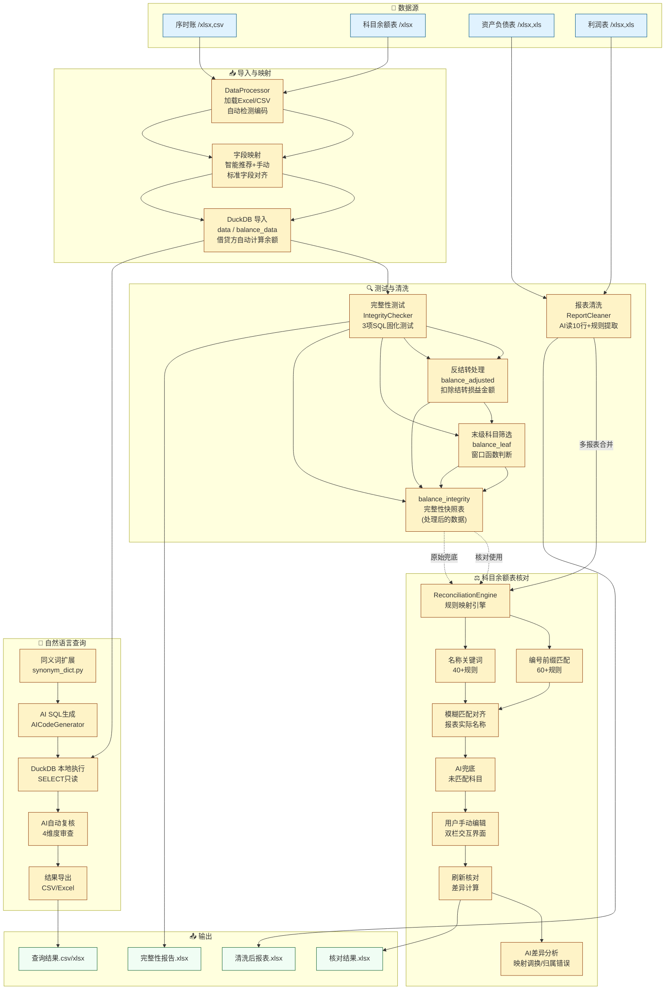

# DA数据清洗业务AI应用 技术文档

## 一、项目概述

DA数据清洗业务AI应用是一个基于 Flask 的本地财务数据查询分析工具，通过自然语言驱动 AI 生成 DuckDB SQL，在本地 DuckDB 引擎中执行。支持序时账（Journal）和科目余额表（Balance Sheet）双表导入、字段映射、AI 智能映射、完整性测试和智能查询。

**技术栈：**
- 后端：Flask 3.0 + Flask-Session（服务端文件存储）
- 数据处理：DuckDB + Pandas 2.1
- AI 接口：Dify Workflow API（Qwen3），支持 env DEEPSEEK_API_KEY 降级 Direct API
- SQL 生成：AI 生成 DuckDB SQL，本地引擎执行
- 财务报表清洗：AI 识别结构（读前 10 行）+ 规则引擎提取（无二次 AI 调用）
- 科目余额表核对：规则映射引擎 + 模糊匹配 + 贪心爬山优化 + AI 差异分析
- 数据加密：Fernet 对称加密（API Key 存储）
- Excel 读写：openpyxl 3.1
- 前端：原生 HTML/CSS/JS（无前端框架），CodeMirror 代码编辑器
- 桌面端：PyInstaller 打包 Windows .exe（GitHub Actions）

---

## 二、目录结构

```
DA数据清洗业务AI应用/
├── app.py                          # Flask 主应用（路由 + 会话管理 + 业务编排）
├── config.py                       # 全局配置（AI 供应商、Secret Key、上传限制）
├── requirements.txt                # Python 依赖
├── start.sh                        # 快速启动脚本
├── TECHNICAL.md                    # 本文件
│
├── modules/                        # 核心业务模块
│   ├── __init__.py
│   ├── data_processor.py           # DataProcessor - Excel/CSV 加载分析
│   ├── duckdb_engine.py            # DuckDBEngine - DuckDB 封装（建表/查询/导出）
│   ├── ai_codegen.py               # AICodeGenerator - AI SQL 生成
│   ├── integrity_checker.py        # IntegrityChecker - DuckDB SQL 完整性测试
│   ├── report_cleaner.py           # ReportCleaner - 财务报表清洗（AI 结构识别 + 规则提取）
│   ├── report_reconciliation.py    # ReconciliationEngine - 科目余额表↔报表核对
│   ├── synonym_dict.py             # 财务同义词词典（本地扩展）
│   ├── mapping_history.py          # 字段映射历史记录与模糊匹配
│   ├── preset_rules.py             # 筛选规则包管理系统
│   ├── sampling.py                 # 审计抽样模块
│   ├── audit_trail.py              # 审计轨迹（操作日志）
│   ├── crypto_utils.py             # API Key 加密/解密（Fernet）
│   └── utils.py                    # 工具函数
│
├── templates/                      # Jinja2 页面模板（5 步流程 + 扩展功能）
│   ├── intro.html                  # 产品介绍首页
│   ├── upload.html                 # 步骤1：文件上传（含 sheet/表头配置）
│   ├── api-config.html             # 已废弃
│   ├── field-mapper.html           # 步骤2：字段映射（含币种/金额模式）
│   ├── integrity-test.html         # 步骤3：完整性测试（4步引导）+ 报表清洗 + 核对
│   └── query.html                  # 步骤4：自然语言查询分析
│
├── static/                         # 静态资源
│   ├── css/style.css
│   ├── js/app.js
│   └── js/report-cleaner.js        # 报表清洗 + 核对 + 优化前端逻辑
│
├── electron/                       # Electron 桌面包装
│   └── main.js
│
├── temp/                           # 上传文件存储目录（自动创建）
├── flask_session/                  # Flask-Session 文件存储目录（自动创建）
│
└── .gitignore
```

---

## 三、5 步工作流

```
[上传文件] → [字段映射] → [完整性测试(可选)] → [查询分析]
  步骤1         步骤2          步骤3        ↓                    步骤5
                                          [财务报表清洗]           
                                          ↓                      
                                          [科目余额表核对]         
```

> 注：完整性测试、财务报表清洗、科目余额表核对均为可选步骤，集成在同一页面底部。

### 第 1 步：上传文件
- 支持格式：`.xlsx`、`.xls`、`.csv`
- 最大文件 50MB
- 上传序时账：`POST /api/upload` → 存储在 `session['data_info']`
- 上传科目余额表（可选）：`POST /api/upload-balance` → 存储在 `session['balance_data_info']`
- **增强功能**：支持选择 Sheet 页、自定义表头行号、预览前 5 行
- 关键操作：`DataProcessor.process()` 加载文件前 100 行进行分析，识别字段类型（text/number/date），生成预览数据

### 第 2 步：字段映射（原 API 配置步骤已移除）
- API 配置已移除，改为硬编码 Dify Workflow API（config.py 中 DIFY_MAIN_* / DIFY_REVIEW_*）
- 可通过环境变量 `DEEPSEEK_API_KEY` 降级为 Direct API 调用
- 支持自定义模型和 API 地址：`DIRECT_MODEL`、`DIRECT_API_URL`

### 第 3 步：字段映射
- 前端将文件原始字段映射到标准字段（11 个序时账字段 + 科目余额表字段）
- 映射格式：`{标准字段名: 源字段名}`
- **AI 智能映射**：点击"AI 智能映射"按钮 → `POST /api/auto-map-fields` → AI 根据列名/类型/样本值自动推荐映射
- **科目余额表格式选择**：支持两种格式
  - **已有期初/期末**（calculated）：直接映射期初余额、期末余额字段
  - **借贷方计算**（debit_credit）：映射期初借方/贷方、期末借方/贷方，由 DuckDB 自动计算 `期初余额 = 期初借方 - 期初贷方`，`期末余额 = 期末借方 - 期末贷方`
  - 选择结果存入 `session['balance_format']`
- 提交：`POST /api/configure-fields`
- 后端保存映射到 session，导入数据到 DuckDB，计算 `mapped_fields` 和 `mapped_preview`
- 支持历史映射匹配：`POST /api/mapping-history/match` 模糊匹配历史映射

### 第 4 步：完整性测试 + 财务报表清洗 + 科目余额表核对（全可选）

#### 4a. 完整性测试
- 基于 DuckDB SQL 的三项固化测试（非 Pandas）
- 支持反结转模式（reverse_carry_forward）和末级科目模式（leaf_accounts）
- 运行后在 DuckDB 创建 `balance_integrity` 快照表（快照在 `finally` 清理前完成，保留处理后的数据）
- 结果可导出为 Excel：`POST /api/integrity-test/export`
- **AI 引导式问答助手**：内置导向式决策树对话流程
  - AI 引导用户确认：ERP 系统、方向调整、反结转、末级科目、排除规则
  - 根据用户反馈动态调用工具执行测试
  - 支持对话中导出测试报告（PDF 格式的报告摘要 + Excel 文件下载）
  - 历史对话在重新导入数据时自动清除（`session.pop('integrity_chat_history')`）
  - 端点：`POST /integrity-chat`

#### 4b. 财务报表清洗
- 上传资产负债表/利润表（`.xlsx` / `.xls`），支持导入多张报表
- **AI 读前 10 行**识别报表结构：报表类型、表头行数、数据起始行、列映射、左右分栏布局
- **规则提取**：跳过汇总行/签名行/注释行/空行，处理左右分栏合并，数值清洗
- 输出标准化列：项目名称 + 期末余额/年初余额（类型自适应）
- 端点：`GET /report-cleaner`（重定向至 integrity-test 页面）

#### 4c. 科目余额表核对
- 将清洗后的报表与科目余额表（`balance_integrity` 快照或原始 `balance_data`）做逐项比对
- **规则映射**：科目编号前缀 60+条 + 名称关键词 40+组 → 自动匹配科目到报表项目
- **模糊匹配对齐**：规则输出标准名 → 模糊匹配到报表实际名称（去编号前缀、统一异体字）
- **可编辑映射**：前端双栏界面，鼠标修改映射关系，点击刷新重新计算
- **AI 差异分析**：将差异行 + 映射关系发给 AI，分析差异模式（映射调换/归属错误等）
- 导出带差异标识的 Excel

### 第 5 步：查询分析
- 用户输入自然语言 → 同义词扩展（本地词典 + AI 优化）→ `POST /api/generate-code` → AI 生成 DuckDB SQL
- SQL 在本地 DuckDB 引擎中执行（仅允许 SELECT 只读查询）
- 支持 SQL 解释、格式化、复制
- 结果导出（CSV/Excel）
- 查询历史记录
- **AI 自动复核**：SQL 生成后自动调用复核模型进行审查，结果以可折叠面板展示
  - 四个维度：语法检查、安全审查、意图匹配、性能优化
  - 每个维度有通过/需关注状态和详细说明

---

## 四、核心模块详解

### 4.1 DataProcessor（`modules/data_processor.py`）

```python
class DataProcessor:
    def __init__(self, filepath: str)
    def load_data(self, sheet_name=None, header_row=None, nrows=None) -> pd.DataFrame
    def get_total_rows(self) -> int
    def analyze_columns(self) -> List[Dict]
    def get_preview_data(self, rows: int = 5) -> List[Dict]
    def process(self, sheet_name=None, header_row=None) -> Dict
    def clean_data(self, df: pd.DataFrame) -> pd.DataFrame
```

- `load_data()`：加载 Excel 或 CSV（自动尝试 utf-8-sig → utf-8 → gbk → gb2312 → latin1 → cp1252）
- 支持指定 sheet_name 和 header_row（0-indexed）
- `analyze_columns()`：检测每列类型（text/number/date），基于样本和关键词匹配
- `clean_data()`：bool 列转字符串，数值 NaN 填充 0，对象列填充空字符串

### 4.2 DuckDBEngine（`modules/duckdb_engine.py`）

```python
class DuckDBEngine:
    def __init__(self, db_path: str = ':memory:')
    def register_dataframe(self, name: str, df: pd.DataFrame)
    def table_exists(self, name: str) -> bool
    def execute_query(self, sql: str) -> Dict
    def export_to_csv(self, sql: str, filepath: str)
    def export_to_excel(self, sql: str, filepath: str)
    def close(self)
```

- 使用内存数据库（`:memory:`），应用重启后数据消失
- `register_dataframe()` 将 Pandas DataFrame 注册为 DuckDB 表
- `execute_query()` 安全执行 SELECT 查询，返回 `{columns, data, summary}`
- SELECT 只读保护：在 SQL 前添加 `SET enforce_guarded_mode=true;`

### 4.3 AICodeGenerator（`modules/ai_codegen.py`）

```python
class AICodeGenerator:
    def __init__(self, api_key: str, provider: str = "deepseek",
                 api_url: str = None, model: str = None)
    def generate(self, query: str, fields_info: List[Dict],
                 data_preview: Optional[List[Dict]]) -> str
    def explain_code(self, sql: str) -> str
    def optimize_query(self, query: str, local_expanded: str = None) -> str
    def test_generation(self, sample_query: str = None) -> Tuple[bool, str]
```

- 构建提示词时将字段信息、数据预览传入 AI
- 严格限制只生成 SELECT 查询
- `_validate_sql()`：检查 SQL 是否以 SELECT/WITH 开头
- `_fix_strftime()`：将 strftime 调用替换为 DuckDB 兼容语法（EXTRACT / DATE_TRUNC）
- `optimize_query()`：优化自然语言查询，三级增强（本地词典 + AI 关键词扩展 + AI 语义优化）
  - 关键词扩展：中文术语 → 英文/缩写变体（调整 → adj、adjustment）
  - 语义优化：模糊概念 → 具体表达（月底 → 最后五天）
  - 人名识别：中文人名 → 拼音全拼 + 首字母缩写（周健 → zhoujian、zj）

**提示词关键约束：**
- 双引号包裹表名和列名（防中文问题）
- 日期处理禁止 strftime，强制使用 `EXTRACT` / `DATE_TRUNC`
- 金额字段须 `CAST` 为 DOUBLE
- 不生成 LIMIT（返回所有匹配记录）
- 保持 SQL 简洁，不写子查询、不生成日期序列表

### 4.4 IntegrityChecker（`modules/integrity_checker.py`）

基于 DuckDB SQL 的三项固化测试：

**测试一：序时账完整性**
- 按公司名+凭证号+日期分组，汇总金额
- 统计正/负/零值分组数
- 预期：各凭证组发生额应为 0（借贷平衡）

**测试二：科目余额表完整性**
- 汇总期初余额、期末余额
- 计算发生额 = 期末 - 期初
- 检查发生额汇总是否归零

**测试三：交叉验证**
- 序时账按公司+科目编号+科目名称汇总金额
- 余额表按同样维度汇总发生额（期末-期初）
- 两表全外连接，比较差异

**关键逻辑 — 结转损益金额：**
- 取科目编号为 `4103`（本年利润）**或**摘要同时包含"结转"和"损益"的记录
- 使用原始 JE 金额（不调整方向）
- 在 `_setup_carry_forward_views()` 中构建：`("科目编号" = '4103') OR ("摘要" LIKE '%结转%' AND "摘要" LIKE '%损益%')`


### 4.5 ReportCleaner（`modules/report_cleaner.py`）— 财务报表清洗

```python
class ReportCleaner:
    def __init__(self)
    def load_file(self, filepath: str) -> list      # 加载 xlsx/xls，返回 sheet 列表
    def preview_raw(self, sheet_name, nrows=10)      # 取前 N 行原始数据
    def ai_detect(self, sheet_name, api_key, ...)    # AI 读前 10 行，识别报表结构
    def extract_by_meta(self, sheet_name, meta)       # 规则引擎提取清洗数据
    def export_to_excel(self, sheet_name, meta)       # 导出清洗后数据为 xlsx
```

**文件加载链路（`load_file`）:**
```
.xlsx → openpyxl（data_only 取公式计算值）
.xls（后缀名错的 xlsx）→ 先 openpyxl → 失败回退 xlrd → 最后复制改后缀名重试
```

**AI 结构检测（`ai_detect`）:**
- 读前 10 行原始数据，以文本格式发送给 AI
- AI 返回结构化 JSON：report_type（balance_sheet / income_statement）、header_rows_count、data_start_row、layout_type（left_right_split / single_side）、columns（映射到标准字段）、skip_keywords
- **零二次 AI 调用**：后续规则提取不依赖 AI

**规则提取（`extract_by_meta`）:**
- 跳过空行、汇总行（合计/总计/小计）、签名行（单位负责人/制表人）、注释行（注：）
- 左右分栏布局 → 拆分为左右两行分别输出
- 数值清洗（去逗号、空转空字符串、公式取缓存值）
- 输出项目名称 + 期末余额/年初余额（资产负债表）或项目名称 + 期末余额（利润表，自动映射本年累计金额→期末余额）

### 4.6 ReconciliationEngine（`modules/report_reconciliation.py`）— 科目余额表↔报表核对

```python
class ReconciliationEngine:
    def __init__(self, db_cursor, balance_fields, balance_table='balance_data')
    def get_balance_mappings(self, report_data, api_key=None)  # 返回映射数据供前端编辑
    def reconcile_with_mappings(self, mappings, report_data)    # 按用户映射重新计算差异
```

**三层映射引擎：**

1. **科目编号前缀匹配**（优先级最高，60+条规则）
   - 标准 4 位前缀：`1001`→货币资金、`1122`→应收账款、`6602`→管理费用……
   - 最长前缀优先匹配

2. **科目名称关键词匹配**（编号无匹配时，40+组规则）
   - 含"银行""现金"→货币资金、含"差旅费""办公费"→管理费用

3. **模糊匹配对齐 `_match_to_actual()`**
   - 规则输出标准名（如"应收账款"）→ 模糊匹配到报表实际名称（如"应收帐款"）
   - 标准化预处理：去编号前缀（"一、营业收入"→"营业收入"）、统一异体字（帐→账）

**AI 差异分析：**
- 接收核对结果中的差异行 + 当前映射关系
- 发送给 AI 分析差异模式：映射调换、归属错误、遗漏科目
- 返回文本建议

**数据源处理：**
- 完整性测试运行后会自动创建 `balance_integrity` 快照表
- 核对优先使用快照表（含反结转调整后的期末余额），兜底原始 `balance_data`

### 4.5 AI 完整性测试助手（`app.py` — `integrity_chat` 路由）

**位置**：`POST /integrity-chat`（位于 `app.py`，非独立模块）

**技术特点：**
- 使用 OpenAI-compatible Function Calling（tools 参数）驱动多轮对话
- 最大 5 轮 tool-calling 递归
- 定义 8 个 `INTEGRITY_TOOLS`：
  1. `run_all_tests` — 执行全部 3 项测试（可选参数：方向调整、排除规则、反结转、末级科目）
  2. `get_journal_analysis` — 序时账单项分析
  3. `get_balance_analysis` — 余额表单项分析
  4. `run_cross_validation` — 交叉验证
  5. `export_report` — 导出完整报告为 Excel（base64 嵌入返回）
  6. `get_session_info` — 获取当前会话配置（字段映射、balance_format、AI 供应商等）
  7. `set_exclusions` — 设置排除规则
  8. `get_test_info` — 获取测试结果摘要

**导向式决策树工作流（`INTEGRITY_SYSTEM_PROMPT`）：**
1. 欢迎并获取会话信息
2. 询问 ERP 系统类型（影响方向调整判断）
3. 询问是否做方向调整
4. 询问反结转模式
5. 询问末级科目模式
6. 询问排除规则（空凭证编号、合计行等）
7. 执行自定义配置的全面测试
8. 展示结果并询问是否需要导出或深入分析

**防幻觉机制：**
- `export_report` 实际调用 DuckDB 重新计算全量明细生成 Excel（不依赖缓存）
- 后端兜底：检测用户含"导出/报告/下载"关键词但 AI 未调工具时，强制导出
- 成功导出后 AI 回复被固定为"报告已生成，请点击下载"（杜绝 AI 虚构下载链接）
- 工具调用前自动重建 trim/direction 临时视图（`CREATE OR REPLACE TEMP VIEW`）

### 4.6 同义词词典（`modules/synonym_dict.py`）

```python
SYNONYM_MAP = {
    "调整": ["调", "adj", "adjustment"],
    "冲销": ["冲", "reverse", "reversal", "storno"],
    "结转": ["结转", "转结", "carry forward", "carryforward"],
    "损益": ["损益", "profit and loss", "pl", "p&l"],
    # ...（覆盖调整/冲销/结转/科目/金额/时间/凭证等）
}

def find_keywords(text: str) -> list
def expand_keywords(text: str) -> str
```

- `find_keywords()`：位置追踪（`occupied` 集合防止重叠匹配），按标准词长度降序排列
- `expand_keywords()`：匹配到关键词后追加"等相关关键词"（不使用括号标注，避免误导 SQL 生成）
- 查询优化流程：本地词典扩展 → AI 优化（合并两者结果）

### 4.8 其他模块

**`crypto_utils.py`**：
- 使用 `cryptography.fernet.Fernet` 对称加密
- `encrypt(plain, key)` / `decrypt(cipher, key)`
- 用于 API Key 在 session 中的安全存储

**`mapping_history.py`**：
- `save_mapping(field_mapping, user_fields, session)` — 保存映射历史到 session
- `find_match(new_user_fields, session)` — 对新上传文件的字段名进行模糊匹配，返回历史映射

**`preset_rules.py`**：
- 内置规则包 + 自定义规则
- 支持规则的 CRUD（增删改查）
- 规则模板含 SQL 参数占位符

**`sampling.py`**：
- 审计抽样方法（统计抽样、非统计抽样）
- `get_methods()` / `generate_sql()`
- 支持按金额单位抽样、随机抽样等

**`audit_trail.py`**：
- `log_generate(session, query, sql)` — 记录查询生成
- `log_execute(session, sql, result)` — 记录执行结果
- 操作日志存储在 session 中

---

## 五、数据流详解

### 字段映射全链路

```
用户选择映射         前端收集           后端处理              DuckDB 注册
┌─────────┐    ┌──────────────┐    ┌──────────────┐    ┌───────────────┐
│  "科目"  │ →  │ field_mapping│ →  │ reverse_     │ →  │ df.rename()   │
│  →       │    │ = {          │    │ mapping →    │    │ → 注册为      │
│ "科目名" │    │   "科目":    │    │ DataFrame    │    │ "data" 表     │
│          │    │   "科目名"   │    │ 重命名为     │    │               │
│ 字段映射UI│    │ }           │    │ 标准字段名   │    │ DuckDB 引擎   │
└─────────┘    └──────────────┘    └──────────────┘    └───────────────┘
```

- `field_mapping` 格式：`{标准字段名: 源字段名}`（前端定义）
- 反向映射：`{源字段名: 标准字段名}`（用于 DataFrame 重命名）
- AI 提示词中展示的是标准字段名
- DuckDB 表名为 `data`（序时账）和 `balance_data`（科目余额表）

### Session 数据模型

| Session Key | 类型 | 说明 |
|-------------|------|------|
| `filepath` | str | 序时账文件路径 |
| `data_info` | dict | 序时账分析结果（fields, preview, mapped_fields, mapped_preview, column_count） |
| `field_mapping` | dict | 序时账字段映射 `{标准名: 源字段名}` |
| `upload_options` | dict | 序时账上传配置（sheet_name, header_row） |
| `balance_filepath` | str | 科目余额表文件路径 |
| `balance_data_info` | dict | 科目余额表分析结果 |
| `balance_format` | str | 科目余额表格式 `'calculated'` 或 `'debit_credit'` |
| `balance_field_mapping` | dict | 科目余额表字段映射 |
| `balance_upload_options` | dict | 科目余额表上传配置 |
| `api_key` | str | 加密后的 API Key（主模型） |
| `ai_provider` | str | AI 供应商 ID（主模型） |
| `ai_model` | str | AI 模型名（主模型） |
| `review_api_key` | str | 加密后的复核模型 API Key（可选） |
| `review_provider` | str | 复核模型供应商 ID |
| `review_model` | str | 复核模型名 |
| `review_api_url` | str | 复核模型自定义 API 地址 |
| `integrity_results` | dict | 完整性测试结果 |
| `report_filepath` | str | 财务报表文件路径（临时会话） |
| `balance_integrity` | table | (DuckDB) 完整性测试后快照的科目余额表，含反结转调整 |
| `integrity_chat_history` | list | 问答助手的多轮对话历史（`[{role, content}]`） |
| `last_execution_result` | dict | 上次查询执行结果 |
| `query_history` | list | 查询历史记录 |
| `manual_fills` | dict | 手动填充的常量列 |
| `mapping_history` | list | 字段映射历史 |

---

## 六、完整数据流图

### 6.1 全流程数据流



### 6.2 财务报表清洗流程

```mermaid
flowchart LR
    subgraph 上传["上传"]
        U1[选择文件<br/>xlsx/xls]
        U2[选择Sheet]
        U3[预览前10行]
    end

    subgraph 检测["AI检测"]
        D1[发送前10行<br/>到AI API]
        D2{AI返回<br/>结构化JSON}
        D3[报表类型<br/>表头行数<br/>数据起始行<br/>列映射<br/>布局方式<br/>跳过关键词]
    end

    subgraph 提取["规则提取"]
        E1[从数据起始行<br/>开始遍历]
        E2{跳过判断}
        E3[空行？→跳过]
        E4[汇总行合计/总计？→跳过]
        E5[签名行？→跳过]
        E6[注释行？→跳过]
        E7[大类标题行？→标记]
        E8[左右分栏？→<br/>拆两行输出]
        E9[数值清洗<br/>去逗号 NaN→空]
    end

    subgraph 输出["输出"]
        O1[资产负债表<br/>项目名称+年初余额+期末余额]
        O2[利润表<br/>项目名称+期末余额<br/>(自动映射本年累计)]
        O3[导出Excel]
    end

    U1 --> U2 --> U3 --> D1 --> D2 --> D3
    D3 --> E1 --> E2
    E2 --> E3
    E2 --> E4
    E2 --> E5
    E2 --> E6
    E2 --> E7
    E2 --> E8
    E7 --> E9
    E8 --> E9
    E9 --> O1
    E9 --> O2
    O1 --> O3
    O2 --> O3

    classDef upload fill:#e0f2fe,stroke:#075985
    classDef detect fill:#fef3c7,stroke:#92400e
    classDef extract fill:#f3e8ff,stroke:#6d28d9
    classDef output fill:#f0fdf4,stroke:#166534
    class U1,U2,U3 upload
    class D1,D2,D3 detect
    class E1,E2,E3,E4,E5,E6,E7,E8,E9 extract
    class O1,O2,O3 output
```

### 6.3 科目余额表核对流程

```mermaid
flowchart LR
    subgraph 准备["数据准备"]
        P1[科目余额表<br/>balance_integrity]
        P2[清洗后报表数据<br/>多报表合并]
    end

    subgraph 映射["映射引擎<br/>ReconciliationEngine"]
        M1{遍历科目<br/>余额表每行}
        M2[编号前缀匹配<br/>60+规则]
        M3[名称关键词匹配<br/>40+规则]
        M4[模糊匹配对齐<br/>报表实际名称]
        M5[AI兜底<br/>未匹配科目]
        M6[用户手动编辑<br/>前端双栏界面]
    end

    subgraph 核对["逐项核对"]
        R1[按报表项目<br/>汇总科目余额]
        R2{与报表金额<br/>逐项比对}
        R3[已匹配<br/>差异≈0]
        R4[有差异<br/>|diff|>0.01]
        R5[仅报表有<br/>report_only]
        R6[未匹配科目<br/>unmatched]
    end

    subgraph 输出["输出"]
        S1[核对结果表<br/>双栏展示]
        S2[AI差异分析<br/>模式识别]
        S3[导出Excel<br/>带差异高亮]
    end

    P1 --> M1
    P2 --> R1
    M1 --> M2
    M1 --> M3
    M2 --> M4
    M3 --> M4
    M4 --> M5
    M5 --> M6
    M6 --> R1
    R1 --> R2
    R2 --> R3
    R2 --> R4
    R2 --> R5
    R2 --> R6
    R3 --> S1
    R4 --> S1
    R5 --> S1
    R6 --> S1
    S1 --> S2
    S1 --> S3

    classDef prep fill:#e0f2fe,stroke:#075985
    classDef map fill:#fef3c7,stroke:#92400e
    classDef check fill:#f3e8ff,stroke:#6d28d9
    classDef out fill:#f0fdf4,stroke:#166534
    class P1,P2 prep
    class M1,M2,M3,M4,M5,M6 map
    class R1,R2,R3,R4,R5,R6 check
    class S1,S2,S3 out
```

## 六、关键 API 端点

| 方法 | 路径 | 功能 |
|------|------|------|
| GET | `/` | 首页（重定向到 upload） |
| GET | `/intro` | 产品介绍页 |
| GET | `/upload` | 上传页面（含 sheet 选择 / 表头行配置） |
| GET | `/api-config` | API 配置页面（多供应商支持） |
| GET | `/field-mapper` | 字段映射页面（需已配置 API Key） |
| GET | `/integrity-test` | 完整性测试页面 |
| GET | `/query` | 查询分析页面 |
| POST | `/api/upload` | 上传序时账文件，调用 `DataProcessor.process()` |
| POST | `/api/upload-balance` | 上传科目余额表文件 |
| POST | `/api/upload/preview` | 上传预览（检测 sheet 和原始行） |
| POST | `/api/configure-fields` | 保存字段映射 → 导入 DuckDB |
| POST | `/api/configure-balance-fields` | 保存科目余额表字段映射 |
| POST | `/api/configure-api` | 保存 API Key（加密后存 session） |
| POST | `/api/auto-map-fields` | **AI 智能映射** — 自动推荐字段映射 |
| POST | `/api/generate-code` | AI 生成 DuckDB SQL |
| POST | `/api/review-code` | **复核 SQL** — 第二 AI 模型审查语法/安全/意图/性能 |
| POST | `/api/explain-code` | AI 解释 SQL |
| POST | `/api/optimize-query` | 查询优化（同义词扩展 + AI 润色） |
| POST | `/api/execute` | 执行 SQL（DuckDB 引擎） |
| POST | `/api/export` | 导出结果为 CSV/Excel |
| GET | `/api/query-history` | 获取查询历史 |
| POST | `/api/integrity-test/run` | 运行完整性测试（支持反结转/末级科目模式） |
| GET | `/api/integrity-test/results` | 获取上次测试结果 |
| POST | `/api/integrity-test/export` | 导出测试结果为 Excel（4 sheet） |
| POST | `/integrity-chat` | 完整性测试 AI 引导问答（多轮对话，tool-calling 驱动） |
| POST | `/api/integrity-test/ai-analyze` | AI 分析异常测试结果（审计视角） |
| POST | `/api/report-upload` | 上传财务报表文件（xlsx/xls），返回 sheet 列表 |
| POST | `/api/report-detect` | AI 识别报表结构（读前 10 行） |
| POST | `/api/report-extract` | 规则提取清洗数据 |
| POST | `/api/report-export` | 导出清洗后数据为 Excel |
| POST | `/api/report-reconciliation` | 科目余额表核对（获取映射数据 / 刷新核算） |
| POST | `/api/report-reconciliation/export` | 导出核对结果 Excel |
| POST | `/api/report-reconciliation/ai-analyze` | AI 差异分析核对结果 |
| GET | `/api/mapping-history/check` | 检查是否有匹配的历史映射 |
| POST | `/api/mapping-history/apply` | 应用历史映射 |
| GET | `/api/preset-rules/packs` | 获取规则包列表 |
| POST | `/api/preset-rules` | 保存自定义规则 |
| DELETE | `/api/preset-rules/<id>` | 删除自定义规则 |

---

## 七、AI SQL 生成与执行

### 生成流程

```
用户自然语言查询
    ↓
同义词扩展（本地 `synonym_dict.py` + AI `optimize_query()`）
    ↓
构建 prompt（含字段信息 + 数据预览 + SQL 约束）
    ↓
调用 AI API → 返回 SQL
    ↓
_fix_strftime()：替换 strftime → EXTRACT/DATE_TRUNC
    ↓
_validate_sql()：确保只含 SELECT/WITH
    ↓
execute_query()：DuckDB 本地执行
    ↓
返回结果（JSON 安全格式）
```

### 安全性
- DuckDB 引擎仅执行 SELECT 查询（`_validate_sql()` 守卫）
- SQL 前注入 `SET enforce_guarded_mode=true;`
- 数据仅在内存中处理，无需网络传输
- API Key 经 Fernet 加密后存 session

### 查询优化（AI 语义增强）

AI 优化查询的三类增强（`POST /api/optimize-query` → `AICodeGenerator.optimize_query()`）：

```
原始查询："筛选出月底做账的凭证"
    ↓ AI 优化
"筛选出每个月最后五天的做账凭证"

原始查询："筛选出摘要中包含调整的凭证"
    ↓ AI 优化
"筛选出摘要中包含调整、adj、adjustment等相关关键词的凭证"

原始查询："筛选出制单人是周健的记录"
    ↓ AI 优化
"筛选出制单人是周健（含 zhoujian、zhou jian、zj、ZJ 等变体）的记录"
```

**三类增强规则：**
1. **语义优化** — 模糊概念变具体：月底→最后五天、月初→前五天、最近→近30天
2. **关键词扩展** — 中文术语补英文/缩写变体：调整→adj/adjustment、冲销→reverse/reversal；不扩展字段名同义词
3. **人名识别** — 2~3字中文人名补充拼音全拼和首字母缩写：周健→zhoujian/zj

**本地词典先行**：`synonym_dict.py` 先做初步同义词匹配，结果作为 AI 的参考上下文。AI 优化结果优先于本地词典。


### AI 代码复核

SQL 生成后自动触发复核，流程如下：

```
主模型生成 SQL
    ↓ 自动触发
POST /api/review-code
    ↓
选用复核模型（独立配置或主模型回退）
    ↓
构建 prompt（含查询语句、SQL、字段信息）
    ↓
调用 AI → 解析 JSON 响应
    ↓
前端可折叠面板展示结果
```

**复核维度：**
1. **语法检查** — DuckDB SQL 语法合规性
2. **安全审查** — 仅含 SELECT 只读操作，无危险语句
3. **意图匹配** — SQL 逻辑是否准确反映用户查询需求
4. **性能优化** — 是否有明显的性能问题

**配置方式（API 配置页）：**
- 可选展开"复核模型配置"区块
- 可指定独立供应商/API Key/模型（方案 B）
- 留空则复用主模型配置
- 配置参数字段：`review_provider`、`review_api_key`、`review_model`、`review_api_url`

**响应格式：**
```json
{
  "success": true,
  "review": {
    "passed": true,
    "summary": "审查结论摘要",
    "aspects": [
      {"name": "语法检查", "passed": true, "reason": "详细说明"},
      {"name": "安全审查", "passed": true, "reason": "详细说明"},
      {"name": "意图匹配", "passed": false, "reason": "详细说明"},
      {"name": "性能优化", "passed": true, "reason": "详细说明"}
    ]
  },
  "model_used": "复核模型名称"
}
```

---

## 八、完整性测试详解（DuckDB SQL）

### 结转损益金额计算

```sql
-- 关键 SQL 片段（integrity_checker.py 中 SQL_CF_VOUCHERS 常量）
WHERE ("科目编号" = '4103') OR ("摘要" LIKE '%结转%' AND "摘要" LIKE '%损益%')
```

- 匹配条件：科目编号为 4103（本年利润）**或**摘要同时包含"结转"和"损益"
- 金额取原始 JE 值（不调整方向）
- 在 `_setup_carry_forward_views()` 方法中构建 CTE 视图

### 导出格式
导出 Excel 包含 4 个 sheet：
1. 序时账完整性
2. 科目余额表完整性
3. 交叉验证
4. 结转损益明细

---

## 九、潜在坑点与注意事项

### 1. bool 列处理顺序
`pd.api.types.is_numeric_dtype()` 在部分 Pandas 版本中对 bool 列返回 `True`。**必须在 `is_numeric_dtype` 之前检查 `is_bool_dtype`**，否则 bool 列会被当作数值列处理。

### 2. session 修改后必须重新赋值
Flask-Session 文件存储基于 pickle。修改 session 中嵌套字典后，必须重新赋值才会持久化：
```python
data_info = session.get('data_info', {})
data_info['mapped_fields'] = mapped_fields
session['data_info'] = data_info  # 必须重新赋值
```

### 3. 完整性测试导出重新加载数据
导出逻辑不依赖 session 中的缓存结果，而是重新加载文件数据并计算全量明细。

### 4. 前端 Flex 布局溢出
查询结果表字段过多时，页面会被撑变形。解决方案：
- `.query-main` 设置 `min-width: 0` 允许 flex 子项收缩
- `.result-preview-card` 设置 `overflow: hidden`
- 表格使用 `overflow: auto` + `max-height: 500px` 实现双轴滚动
- 查询历史使用 `text-overflow: ellipsis` 截断长文本

### 5. 字段映射格式
- 前端收集：`mapping[stdField.name] = selectedField` → `{标准字段名: 源字段名}`
- 后端存储：直接保存 `field_mapping`
- DataFrame 重命名：反转映射 `{v: k}` → `{源字段名: 标准字段名}` → `df.rename(columns=reverse)`

### 6. CSV 编码
加载 CSV 时尝试 `utf-8-sig` → `utf-8` → `gbk` → `gb2312` → `latin1` → `cp1252`。

### 7. 字段映射页面路由守卫
- 未上传数据 → 重定向到 `/upload`
- 未配置 API Key → 重定向到 `/api-config`
- 这是为了保护 AI 智能映射功能可用

### 8. 结转损益金额有三条路径，必须一致

结转损益金额涉及三条路径，逻辑必须对齐：

**路径 A：`IntegrityChecker.run_all()` / `export_report()`（核心基准）**
- [`integrity_checker.py`](modules/integrity_checker.py) 中 SQL_CF_VOUCHERS + SQL_CF_AMOUNTS
- 先方向调整（`_setup_direction_views()` → `_j_dir`），再找匹配凭证
- **凭证级匹配**：DISTINCT 公司名+日期+凭证号，再 JOIN 回原表**汇总整张凭证的全部金额**
- 结果 = Sum(整张结转损益凭证的所有行，金额已方向调整)

**路径 B：前端仪表盘（已删除）**
- 曾用 `refreshDirectCfAmount()` 独立查询 `"data"` 原始表
- 但仅汇总**单行匹配**（非整张凭证），且异步调用覆盖了路径 A 的正确值
- ✅ 已删除此函数，统一使用路径 A 的 `carry_forward_info.cf_total_amount`

**路径 C：Chat Assistant `export_report` 工具**
- [`app.py:969`](app.py#L969) 调用 `checker.export_report()`
- 复用 IntegrityChecker，与路径 A 完全一致

**注意**：路径 A 的金额是"整张结转损益凭证"的合计数，大于仅匹配行的金额。这是因为结转账中通常包含多个科目行，只有部分行科目编号=4103，但整张凭证都应视为结转损益处理。

### 9. strftime 替换
DuckDB 支持 `strftime`，但为了兼容性，代码生成器 `_fix_strftime()` 会将其替换为标准 SQL：
- `%Y-%m-%d` → `CAST(CAST(col AS DATE) AS VARCHAR)`
- `%Y-%m` → `CAST(DATE_TRUNC('month', CAST(col AS DATE)) AS VARCHAR)`
- `%Y` → `CAST(EXTRACT(YEAR FROM CAST(col AS DATE)) AS VARCHAR)`

### 10. 完整性助手视图冲突
`integrity_chat` 多轮 tool-calling 中，多次调用会反复创建临时视图。解决方案：使用 `CREATE OR REPLACE TEMP VIEW` 替代 `CREATE TEMP VIEW`。

### 11. 借贷方计算余额表的完整性测试
当 `balance_format === 'debit_credit'` 时：
- 导入时在 DuckDB 中 `ALTER TABLE ADD COLUMN` 计算 `期初余额 = 期初借方 - 期初贷方`，`期末余额 = 期末借方 - 期末贷方`
- 方向调整不适用于计算出的余额（科目余额表没有借贷方方向，余额本身就是净额）
- 余额表测试和交叉验证仍按标准字段名（期初余额/期末余额）即可执行

### 12. 字段映射页面格式切换不生效的排查
`renderBalanceMapping` 定义在 `DOMContentLoaded` 回调内部，而 `onBalanceFormatChange` 从 radio button 的 `onchange` 属性调用，后者是全局函数无法访问回调内局部函数。解决方案：`onBalanceFormatChange` 直接调用全局 `renderMappingTable`。

---

## 十、开发与调试

### 启动
```bash
cd DA数据清洗业务AI应用
source venv/bin/activate
pip install -r requirements.txt
python app.py
# 访问 http://localhost:5003
```

### 端口占用
```bash
lsof -ti:5003 | xargs kill -9
```

### 调试日志
在 `app.py` 的关键路径中已内置 `app.logger.info()` 日志：
- `configure_fields()` 中打印 field_mapping 和 data_info.keys()
- `generate_code()` 中打印传递给 AI 的字段名列表和生成的 SQL

### 新增模块
在 `modules/` 下新建文件，`app.py` 顶部 import 即可。

### 新增路由
参考现有路由模式：页面路由返回 `render_template()`，API 路由返回 `jsonify()`。

---

## 十一、Windows 打包

### 方式一：GitHub Actions（推荐）

仓库已配置 `.github/workflows/build-win.yml`，自动构建 Windows .exe：

1. 推送代码到 GitHub
2. 进入仓库 Actions 页面
3. 选择 **"构建 Windows 版"** → **"Run workflow"**
4. 等待几分钟，下载 **DA数据清洗工具-Windows** 工件（artifact）
5. 解压后双击 `DA数据清洗工具.exe` 即可运行

> 推送 git tag（如 `v1.3.0`）也会自动触发构建。

### 方式二：Windows 本机构建

在 Windows 电脑上操作：

1. 安装 Python 3.9+（[python.org](https://www.python.org/downloads/)）
2. 双击项目根目录的 `build_win.bat`
3. 等待依赖安装和打包完成
4. 在 `dist\DA数据清洗工具\` 找到 `DA数据清洗工具.exe`

### 分发注意事项

- `--windowed` 模式：不开命令行窗口，用户双击即用
- 首次运行可能被 Windows Defender 拦截 → 点击"更多信息"→"仍要运行"
- 数据存储在 `%USERPROFILE%\.da-cleaner\` 目录（session、上传文件、DuckDB 数据库）
- macOS 打包：使用 `pyinstaller --windowed --add-data ... run.py`（路径分隔符用 `:`）

---

## 十二、依赖清单

| 包名 | 版本 | 用途 |
|------|------|------|
| Flask | 3.0.0 | Web 框架 |
| Flask-Session | 0.8.0 | 服务端会话存储（filesystem） |
| duckdb | 1.0+ | 嵌入式 SQL 引擎 |
| pandas | 2.1.4 | 数据处理（加载/清洗） |
| numpy | 1.26.0 | 数值计算 |
| requests | 2.31.0 | 调用 AI API |
| openpyxl | 3.1.2 | Excel 读写 |
| xlrd | 1.2.0 | 旧版 .xls 文件支持 |
| cryptography | 41.0+ | API Key 加密（Fernet） |
| Werkzeug | 3.0.1 | Flask 依赖 |
| python-dotenv | 1.0.0 | 环境变量加载 |
